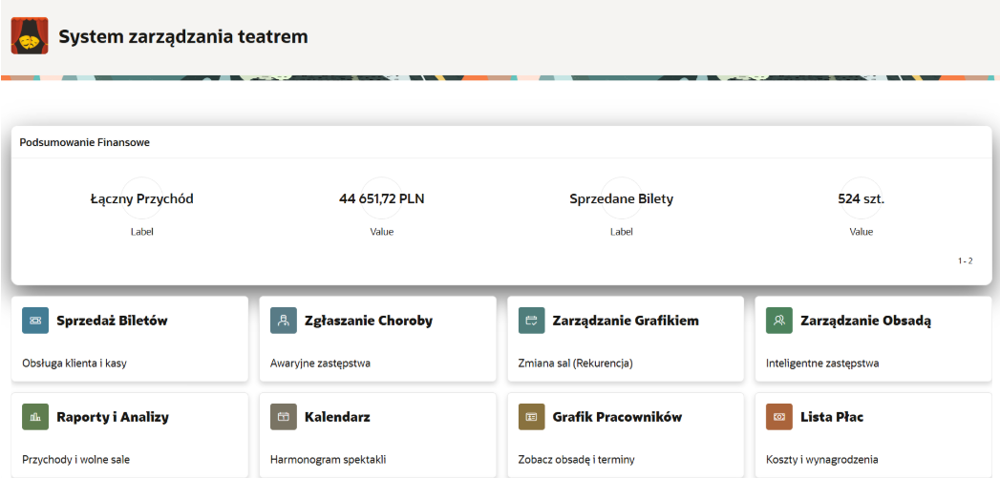
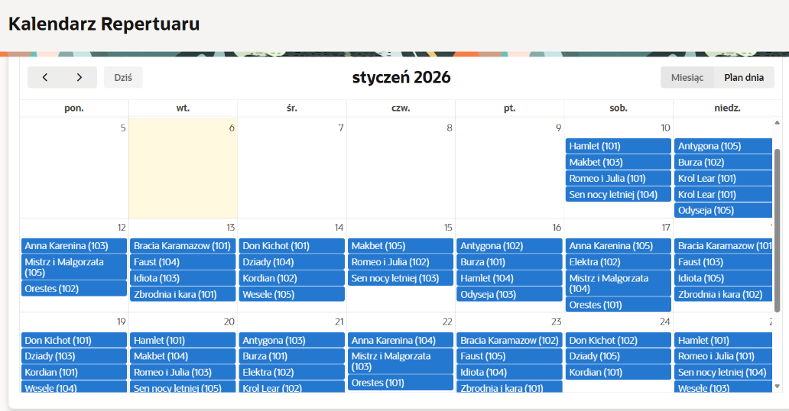
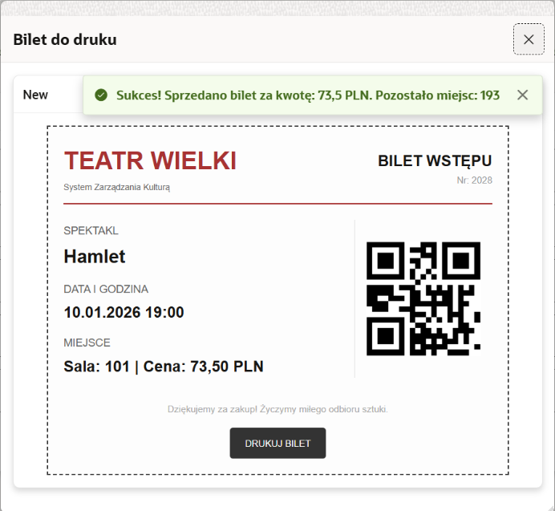
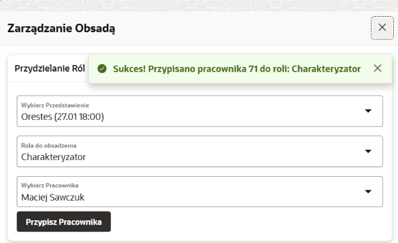

# System zarządzania teatrem - Relacyjna baza danych & Aplikacja Oracle APEX

## Opis projektu
Kompleksowy projekt inżynierski obejmujący pełen cykl projektowania i implementacji relacyjnej bazy danych dla systemu ewidencji spektakli, sprzedaży biletów oraz zarządzania zasobami ludzkimi i infrastrukturą instytucji kultury. Integralną częścią systemu jest w pełni responsywna aplikacja webowa stworzona w środowisku Oracle APEX, która automatyzuje operacje biznesowe teatru w czasie rzeczywistym.

Projekt zrealizowany w ramach przedmiotów bazodanowych na Politechnice Rzeszowskiej.

## Technologie i narzędzia
* **Środowisko Low-Code:** Oracle APEX (Application Express)
* **Silnik bazy danych:** Oracle Database
* **Narzędzia programistyczne:** SQL Developer
* **Języki programowania:** SQL, PL/SQL (zaawansowane pakiety, procedury, funkcje potokowe, wyzwalacze)

## Kluczowe funkcjonalności backendowe (PL/SQL)
* **Pakiety API (`HARMONOGRAM_SALA_API`, `OBSADA_API_PLAN_A`):** Pełna enkapsulacja logiki biznesowej, automatyczne zarządzanie dostępnością sal i harmonogramem spektakli.
* **Automatyzacja sytuacji awaryjnych (`OBSADA_CHOROBA_PLAN_A`):** Zaawansowane procedury automatycznego zastępstwa personelu artystycznego w przypadku zdarzeń losowych (np. choroba aktora).
* **Moduł biletowy i transakcyjny (`OBSADA_REZERWACJE_API`):** Transakcyjna obsługa rezerwacji, walidacja dostępności wolnych miejsc oraz automatyczna aktualizacja stanów magazynowych sal.
* **Wydajność BI:** Zastosowanie funkcji potokowych (`PIPELINED`) oraz kursorów referencyjnych (`REF CURSOR`) do błyskawicznego generowania raportów finansowych bez obciążania struktury transakcyjnej.

---

## Podgląd interfejsu aplikacji (Oracle APEX)

### 1. Panel główny (dashboard) i moduły systemu
Ekran startowy prezentujący kluczowe wskaźniki finansowe i operacyjne (łączny przychód, sprzedane bilety) w formie interaktywnych wykresów oraz dający centralny dostęp do głównych modułów operacyjnych teatru.

<kbd>
  
</kbd>

### 2. Kalendarz repertuaru
Dynamiczny widok kalendarza pobierający dane bezpośrednio z bazy danych za pomocą zapytań SQL, umożliwiający intuicyjny podgląd, filtrowanie oraz planowanie spektakli w danym miesiącu.

<kbd>
  
</kbd>

### 3. Generowanie biletów i obsługa kasowa
Moduł sprzedażowy z interfejsem dla kasjera. Po udanej transakcji system w ramach jednej transakcji blokuje miejsca w bazie, aktualizuje stan widowni i generuje gotowy do druku bilet wyposażony w unikalny kod QR.

<kbd>
  
</kbd>

### 4. Zarządzanie obsadą i logika biznesowa
Zaawansowane formularze pozwalające na dynamiczne przypisywanie personelu (aktorów, reżyserów, obsługi technicznej) do konkretnych wydarzeń, zabezpieczone walidacjami bazodanowymi zapobiegającymi m.in. nakładaniu się terminów dla tego samego pracownika.

<kbd>
  
</kbd>

---

## Struktura repozytorium i dokumentacja
* `baza.sql` — Skrypt DDL tworzący strukturę tabel, relacje, klucze główne, obce oraz więzy integralności (constraints).
* `pakiety.sql` / `f218566.sql` — Pliki źródłowe zawierające implementację zaawansowanej logiki biznesowej, specyfikacje i ciała pakietów PL/SQL.
* `Sprawozdanie.pdf` — Pełna, obszerna dokumentacja akademicka (ok. 100 stron) zwierająca analizę wymagań, diagramy przypadków użycia (Use Case), model relacyjny oraz pełną specyfikację techniczną wdrożonych komponentów.

---
